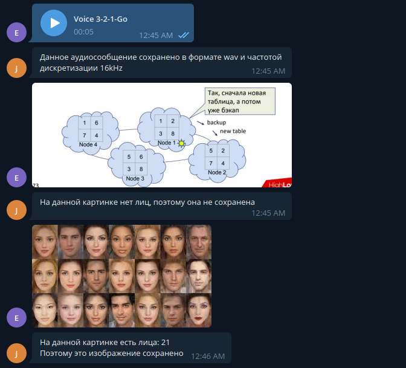

# saving_bot
Конвертирвет аудиосообщения в формат wav с частотой дискретизации 16kHz и сохраняет его в папку audios/audio_message_k, где k номер сохраненного аудиосообщения.
Проверяет, если на изображении лица и если есть сохраняет в папку images/image_message_k, где k номер сохраненного изображения.
Для сопоставления сохраненных файлов и пользователей используется sqlite. В таблице data есть следующие поля:
1) user_id
2) chat_id
3) type - тип хранимого объекта(картинка или аудио)
4) path - путь до объекта

## Пример работы:

